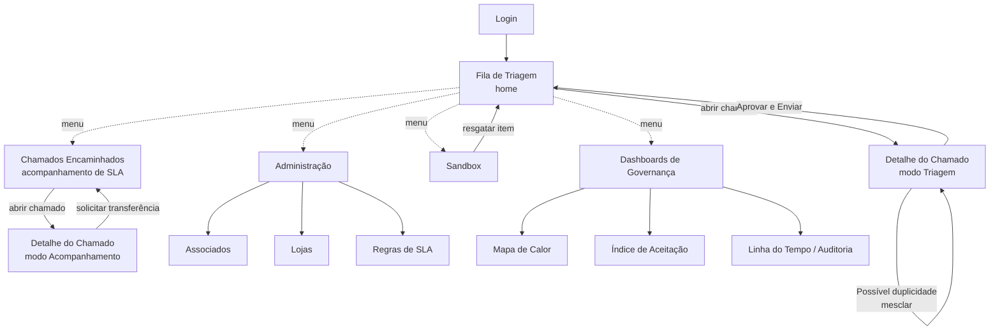

# Fluxo de Navegação — Operador de Triagem

O Operador de Triagem é o **usuário principal da ferramenta**: monitora tudo o que entra, encaminha para o associado certo, cobra a resolução dentro do prazo e é o único perfil (fora o resumo do Atendente Telefônico) que aprova o que efetivamente é dito ao cliente.

## Mapa geral de telas

## 1. Fila de Triagem (tela inicial pós-login)

Chamados ainda **não atribuídos** — vindos da esteira automática (Épico 1, já classificados pela IA) ou abertos manualmente pelo Atendente Telefônico.

- Lista/tabela ordenável.
- Filtros de seleção múltipla: Fonte, Severidade sugerida, Data.
- Cada linha mostra: canal de origem, trecho da manifestação, tags da IA (Severidade / Sentimento / Tema), alerta de duplicidade quando aplicável.
- Ação principal: abrir o chamado → **Detalhe do Chamado (modo Triagem)**.

## 2. Detalhe do Chamado — modo Triagem

Chamado ainda não atribuído a um associado.

- Dados capturados: canal, texto original, link para a postagem original (quando existir).
- Tags da IA (severidade, sentimento, tema) e rascunho de resposta — **sempre editável**.
- Se o sistema apontou possível duplicidade: alerta visual + opção de mesclar com o chamado existente (decisão sempre manual).
- Campo de seleção do **associado responsável** (entre os 11).
- Botão **"Aprovar e Enviar"**: dispara a resposta ao cliente, muda o status para "Encaminhado", inicia o cronômetro de SLA e retorna o operador para a Fila de Triagem.

## 3. Chamados Encaminhados (acompanhamento e cobrança)

Chamados já atribuídos a um associado — é daqui que o Operador cobra a resolução.

- Lista ordenável por tempo restante de SLA (semáforo verde/amarelo/vermelho).
- Filtro por associado, severidade, status.
- Abrir um chamado leva ao **Detalhe do Chamado (modo Acompanhamento)**: visão de leitura do progresso — o operador não resolve o chamado (isso é do associado), mas pode:
  - Ver a linha do tempo de eventos até agora.
  - Iniciar/gerenciar uma transferência de custódia, se o chamado foi atribuído ao associado errado.

## 4. Sandbox

- Mensagens filtradas como ruído, com contagem regressiva para expurgo automático (7 dias).
- Ação: resgatar manualmente um item → volta para a Fila de Triagem.

## 5. Administração

Acesso pouco frequente, fora do fluxo diário de triagem.

- **Associados**: cadastro das 11 contas.
- **Lojas**: cadastro vinculado a um associado, com dado de localização (usado no mapa de calor).
- **Regras de SLA**: prazo por severidade/tipo de problema.

## 6. Dashboards de Governança

- Mapa de Calor geográfico das lojas.
- Índice de Aceitação (ranking Top 3 / Bottom 3).
- Linha do Tempo / Auditoria — acessível também a partir de qualquer chamado, não só pelos que passaram pela Fila.

:::info Decisões — 16/07/2026
- **Ordenação padrão da Fila de Triagem**: severidade (desc) primeiro, depois mais antigo primeiro — confirma a proposta.
- **"Cobrar associado"**: não existe ação explícita de lembrete manual nesta versão — notificação ativa foi fechada como Won't Have; o semáforo visual é o único sinal de cobrança. Ver [Triagem e Workflow](../03-regras-de-negocio/02-triagem-e-workflow.md).
- **Concorrência entre operadores**: lock soft ("em análise por [nome]") ao abrir um chamado — ver [regra completa](../03-regras-de-negocio/02-triagem-e-workflow.md#concorrência-entre-operadores).
:::
