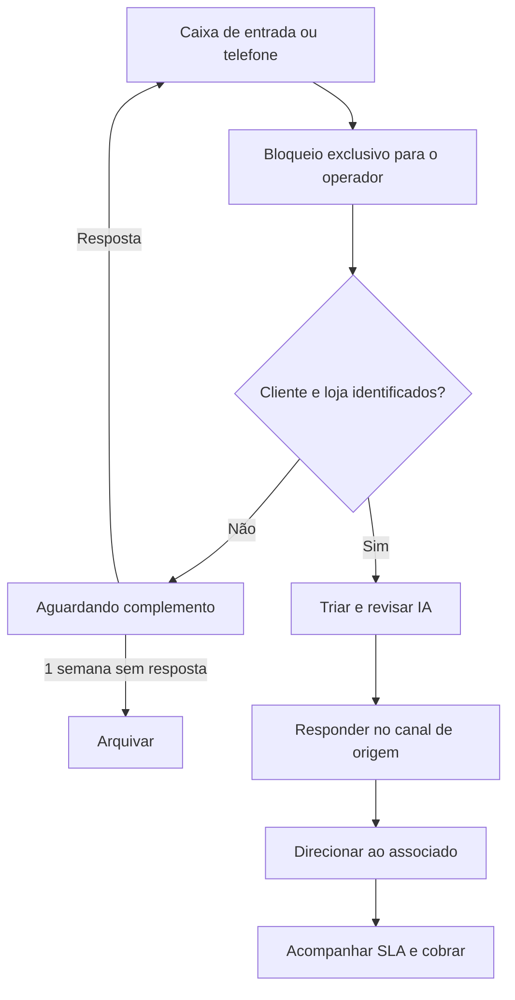

# Fluxo de Navegação — Operador de SAC

O Operador de SAC trabalha em painel único: registra telefone, recebe a caixa de entrada, consulta contexto no SAC, tria, responde, direciona e acompanha o associado.

## Caixa de entrada

- Mostra canal, severidade, sentimento, tema, possível duplicidade e situação do chamado.
- Ao iniciar o tratamento, o chamado fica bloqueado para os demais operadores; eles veem quem o está tratando.
- O operador decide unir, relacionar ou ignorar alertas de duplicidade.

## Telefone e complemento

- No mesmo painel, o operador registra a ligação e tenta identificar cliente e loja usando o contexto disponível.
- Quando faltarem dados, o status é **Aguardando complemento**. O tempo em triagem e o tempo aguardando cliente são exibidos separadamente.
- Há até três tentativas de complemento, com intervalo de 24 horas. Após uma semana sem retorno, o chamado é arquivado; uma resposta posterior devolve o caso à caixa de entrada.

## Direcionamento e SLA

- Depois de revisar a resposta, o operador responde no canal de origem e registra cópia por e-mail quando houver.
- O direcionamento ao associado inicia o SLA do associado.
- Acompanhamento mostra tempo total, triagem, espera por cliente e SLA do associado.
- Correção de loja no mesmo associado é direta. Redirecionamento a outro associado cria novo ciclo de SLA e preserva todos os eventos anteriores.
