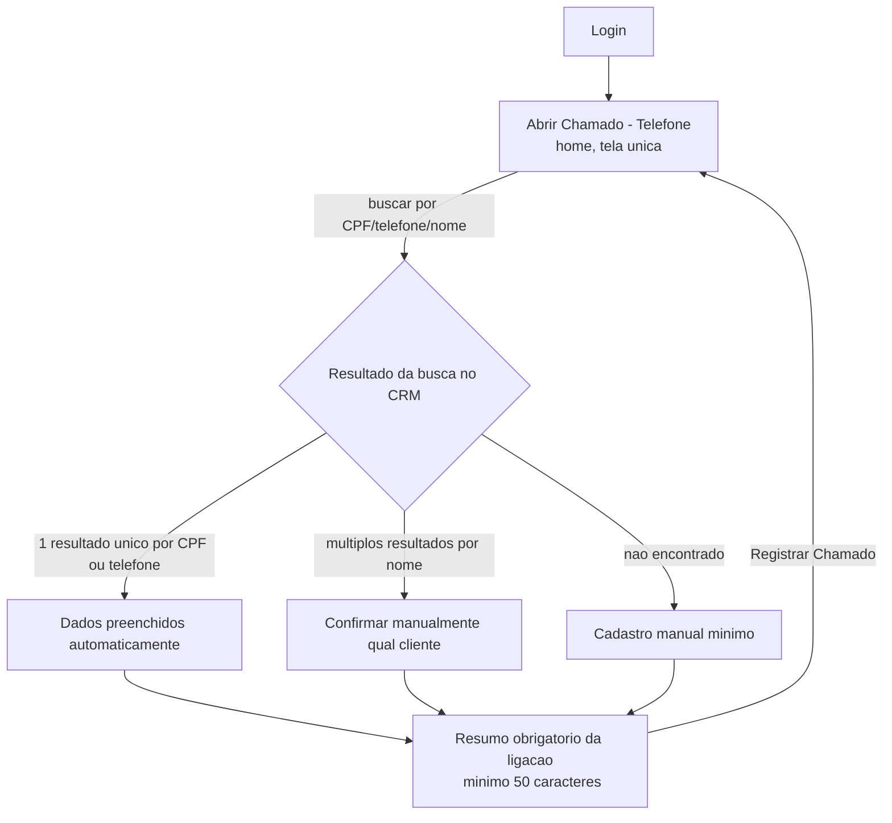

# Fluxo de Navegação — Atendente Telefônico

O Atendente Telefônico tem uma única tela de trabalho: recebe a ligação, busca o cliente no CRM, registra o resumo da conversa e o chamado segue para a Fila de Triagem do Operador — sem passar pela esteira automática nem pela sugestão de resposta da IA (a comunicação já ocorreu ao vivo).

## Mapa geral de telas

## 1. Abrir Chamado — Telefone (tela única pós-login)

- **Busca do cliente no CRM**, por ordem de preferência: CPF (preferencial) → telefone → nome.
  - Busca por CPF ou telefone com exatamente um resultado: dados existentes preenchidos automaticamente.
  - Busca só por nome com mais de um resultado: sistema lista os candidatos e exige confirmação manual do atendente — nunca vincula automaticamente.
  - Cliente não encontrado: atendente cadastra manualmente os dados mínimos necessários.
- **Campo de resumo da comunicação** (obrigatório, mínimo **50 caracteres**): registro oficial da ligação para fins de auditoria e linha do tempo. Continua sendo obrigatório mesmo com a transcrição automática via UCM6204 + Whisper (ver [regra completa](../03-regras-de-negocio/02-triagem-e-workflow.md#transcricao-automatica-da-ligacao)) — a tela do Atendente **não muda** com essa integração: o enriquecimento por transcrição acontece depois, de forma assíncrona, e aparece só para o Operador de Triagem.
- **Classificação e associado responsável não aparecem aqui**: ao clicar em "Registrar Chamado", o item entra na Fila de Triagem do Operador já com o resumo anexado, e segue dali em diante o fluxo padrão (classificação de severidade, atribuição, disparo de SLA) sob responsabilidade do Operador de Triagem — não mais do Atendente.
- Após registrar, a tela volta ao estado inicial, pronta para a próxima ligação.

:::note Fora de tela
Fila de triagem geral, dashboards, cadastro e aprovação de respostas de outros canais não são acessíveis a este perfil — ver [Personas e Permissões](../02-personas-e-permissoes/index.md).
:::
