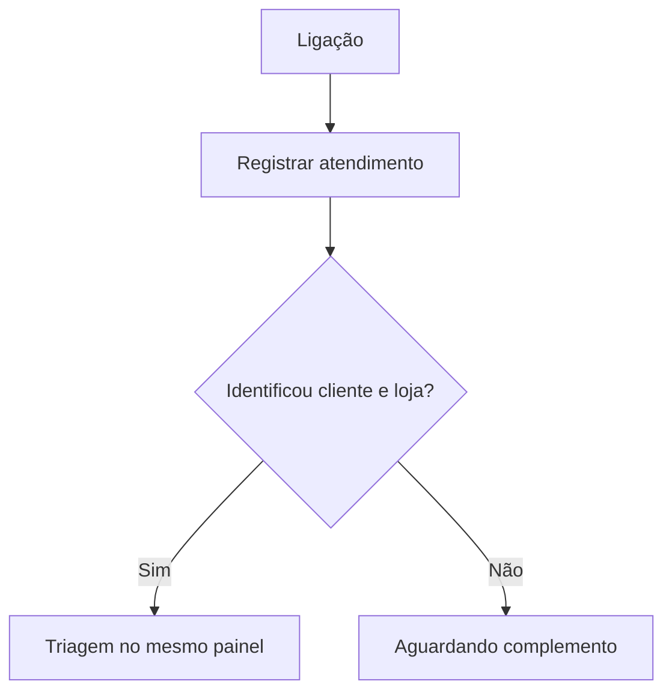

# Fluxo de Telefone — Operador de SAC

Telefone não é um perfil separado. O Operador de SAC abre o chamado no mesmo painel da caixa de entrada e registra o atendimento.

- O operador tenta identificar cliente e loja antes de solicitar complemento.
- O atendimento e as tentativas ficam registrados na linha do tempo.
- Se houver e-mail, ele é registrado para permitir a devolutiva ao cliente. Não há área de acompanhamento para o cliente no MVP.
- O SLA do associado não começa no telefone; começa somente após o direcionamento ao associado.
