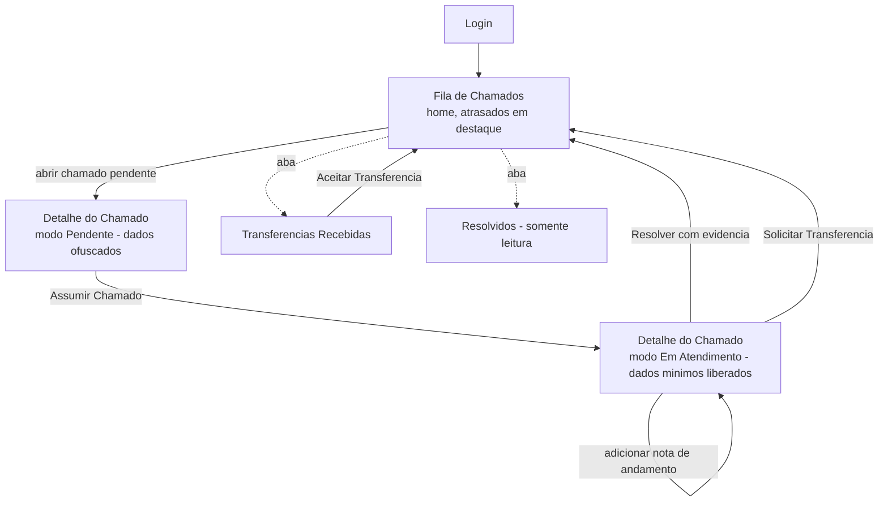

# Fluxo de Navegação — Associado

O Associado recebe o chamado já classificado e atribuído pelo Operador de Triagem, resolve na ponta e reporta o que foi feito. Dados do cliente ficam minimizados por LGPD, e chamados atrasados precisam chamar atenção — o associado não pode simplesmente ignorá-los dentro de uma lista comum.

## Mapa geral de telas

## 1. Fila de Chamados (tela inicial pós-login)

- Mostra os chamados de **todas as lojas vinculadas** ao associado, com filtro por loja.
- **Chamados em atraso (SLA estourado) aparecem em destaque**: ordenados no topo, com cor de alerta e um contador visível assim que o associado loga (ex.: "3 chamados em atraso"). Objetivo é pressionar a finalização, não só informar.
- Três visões/abas: **Meus Chamados** (fila principal, em aberto), **Transferências Recebidas** (chamados que outro associado quer repassar para este) e **Resolvidos** (histórico somente leitura — ver [Portal do Associado](../03-regras-de-negocio/03-portal-do-associado.md#chamados-resolvidos-histórico)).
- Ação principal: abrir um chamado → **Detalhe do Chamado**.

## 2. Detalhe do Chamado — organização da tela

Layout em duas colunas — ver [Portal do Associado](../03-regras-de-negocio/03-portal-do-associado.md#organização-da-tela-de-detalhe) para a lista completa de regras e campos:

- **Coluna central (principal)** — interações do chamado, em ordem cronológica: linha do tempo/auditoria (abertura, atribuição, transferências, notas) e o campo de notas de andamento. É onde o associado acompanha o que já foi feito e registra a próxima tratativa; o campo de Ação Corretiva + botão **"Resolver"** ficam no final desta coluna, como o encerramento da interação.
- **Coluna lateral (à direita)** — informações de apoio, sem interação direta, em dois blocos:
  1. **Status do Chamado**: número, canal de origem, data de abertura, status/etapa atual, vencimento do SLA (mesmo semáforo verde/amarelo/vermelho da Fila), data de resolução, reaberturas (quantidade + link para o chamado vinculado, quando aplicável) e tempo de vida (horas corridas e horas úteis).
  2. **Dados do Cliente + Visão 360º**: dado sensível, sujeito às regras de minimização/ofuscação abaixo.
- Botões de custódia **"Assumir Chamado"** e **"Solicitar Transferência"** ficam fixos na coluna lateral, junto do bloco de Status — são ações sobre o chamado como um todo, não parte da conversa central.

## 3. Detalhe do Chamado — modo Pendente (antes de assumir)

- Bloco de Dados do Cliente, na lateral, aparece **ofuscado** (ex.: `joao.***@gmail.com`, `(21) 9****-1234`).
- Botão **"Assumir Chamado"**: libera os dados mínimos necessários (ver regra de minimização abaixo) e muda o status para "Em Atendimento".

## 4. Detalhe do Chamado — modo Em Atendimento

- Dados do cliente liberados **apenas no necessário para contato**: nome e telefone sempre; e-mail só quando o canal de origem for e-mail. CPF nunca aparece (fica só como chave interna no CRM). Ver [Portal do Associado](../03-regras-de-negocio/03-portal-do-associado.md) para a decisão completa.
- **Visão 360º do cliente**: cards de chamados anteriores do mesmo cliente na rede, sem dados financeiros/CRM (exclusivos do Operador de Triagem).
- **Notas de andamento**: campo para registrar tratativas intermediárias (ex.: "produto recolhido às 14h"), com data/hora, visíveis também ao Operador de Triagem.
- Botão **"Resolver"**: só habilita com o campo obrigatório de Ação Corretiva preenchido (mínimo de caracteres a definir) e permite anexar evidência (PDF/imagem). Ao confirmar, o SLA para permanentemente e o associado volta para a Fila.
- Botão **"Solicitar Transferência"**: usado quando o chamado não é desta loja/associado — abre a seleção do associado de destino correto. O chamado continua no painel deste associado, com SLA rodando, até o destino aceitar.

## 5. Transferências Recebidas

- Lista de chamados que outros associados solicitaram transferir para este.
- Ação: **"Aceitar Transferência"** — o chamado passa a aparecer em "Meus Chamados", ainda no modo Pendente (o novo custodiante também precisa clicar em "Assumir Chamado" para liberar os dados, mesmo que o associado anterior já tivesse acesso).

## 6. Nota de Satisfação (indicador, não é uma tela de ação)

- No cabeçalho da Fila de Chamados, o associado vê a nota média de satisfação (1–5) das próprias lojas, alimentada pela Pesquisa de Satisfação pós-atendimento (Épico 6) — indicador de leitura, sem ação vinculada.
