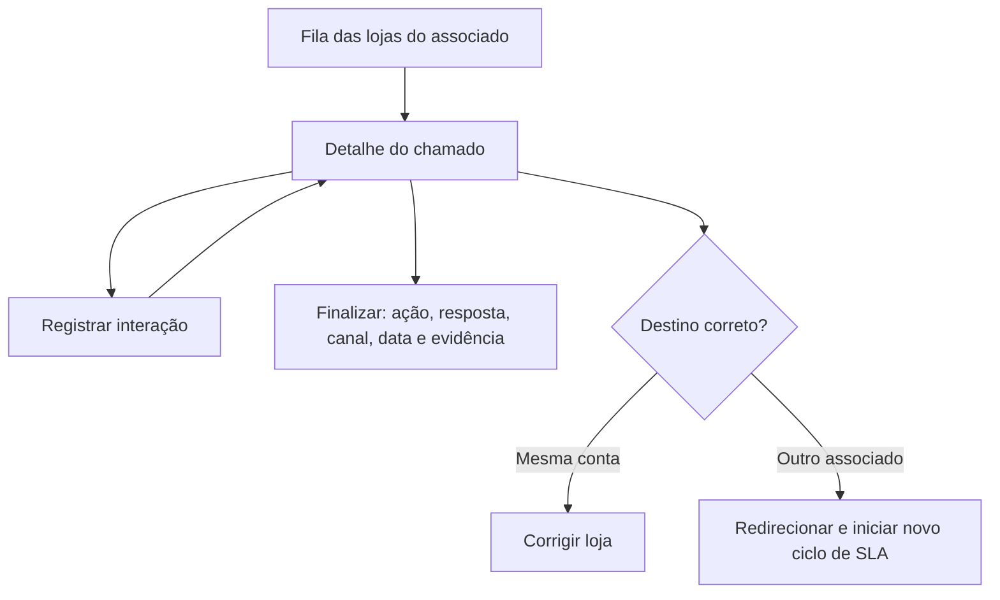

# Fluxo de Navegação — Associado

O associado opera uma única conta para suas lojas. Recebe o chamado, registra a tratativa e finaliza com devolutiva e evidência quando aplicável.

## Fila e detalhe

- A fila mostra chamados abertos, próximos do SLA, vencidos e finalizados, com filtro por loja.
- A tela mostra tempo total, tempo em triagem, tempo aguardando cliente e SLA do associado, além da linha do tempo.
- A conta registra **Interações** com participante, canal, resumo, ação/próximo passo e anexos; pode atuar em nome de Jurídico ou gerente.

## Finalização e indicadores

- Finalização exige ação tomada, resposta, canal, data e anexos quando a natureza do caso exigir.
- Casos Sensível/Jurídico seguem o SLA da severidade e têm detalhes restritos.
- O dashboard do associado apresenta seus próprios indicadores, sem comparação com outros associados.
