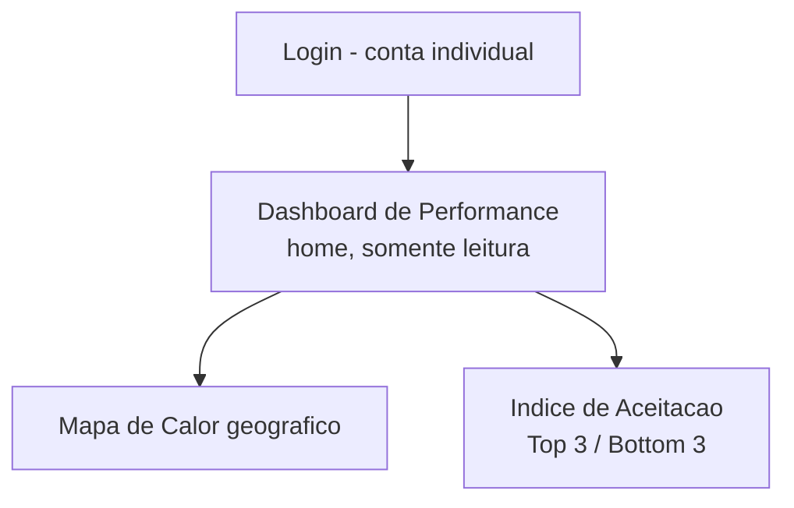

# Fluxo de Navegação — Diretoria

A Diretoria (André Legey e Danielle Moitas, cada um com conta individual — decisão de 16/07/2026) acessa só os indicadores agregados de performance, em modo leitura. Sem dados de contato de clientes, sem linha do tempo individual de chamados.

## Mapa geral de telas

## 1. Dashboard de Performance (tela inicial pós-login, única área do sistema)

- **Mapa de Calor**: mesma visualização geográfica do Operador de Triagem — pinos coloridos por saúde de SLA/sentimento, agrupamento em clusters, balão com associado + chamados em aberto + SLA médio ao clicar. Ver [Dashboards e Governança](../03-regras-de-negocio/04-dashboards-e-governanca.md).
- **Índice de Aceitação**: score da marca e "Top 3 / Bottom 3 Associados", agora ponderando também a nota da Pesquisa de Satisfação (Épico 6).
- **Sem acesso**: fila de triagem, chamados individuais, linha do tempo/auditoria por chamado, dados de contato de clientes, dados financeiros/comportamentais do CRM — tudo isso é exclusivo do Operador de Triagem.
