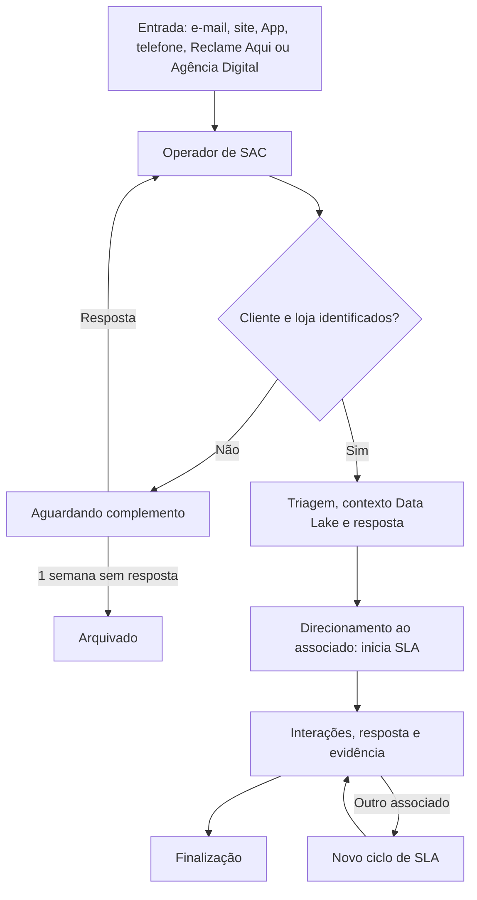

# Ciclo de Vida do Chamado

Este fluxo substitui a leitura operacional do diagrama BPMN anterior para o MVP atual.

## Regras do ciclo

- O Operador de SAC bloqueia exclusivamente o chamado enquanto o trata.
- O Data Lake enriquece o chamado em modo leitura; não recebe reclamações.
- Tempo total, tempo em triagem, tempo aguardando cliente e SLA do associado são registrados separadamente.
- O SLA do associado começa no direcionamento e termina com a finalização que registra resposta e evidência.
- Correções de loja no mesmo associado são diretas. Redirecionamentos entre associados preservam eventos e ciclos anteriores.
- Casos Sensível/Jurídico seguem o SLA da severidade, com rastreabilidade reforçada e sem detalhes nos dashboards gerais.

O arquivo BPMN histórico permanece no repositório como referência técnica, mas este documento e os fluxos por persona são a fonte funcional do MVP.
